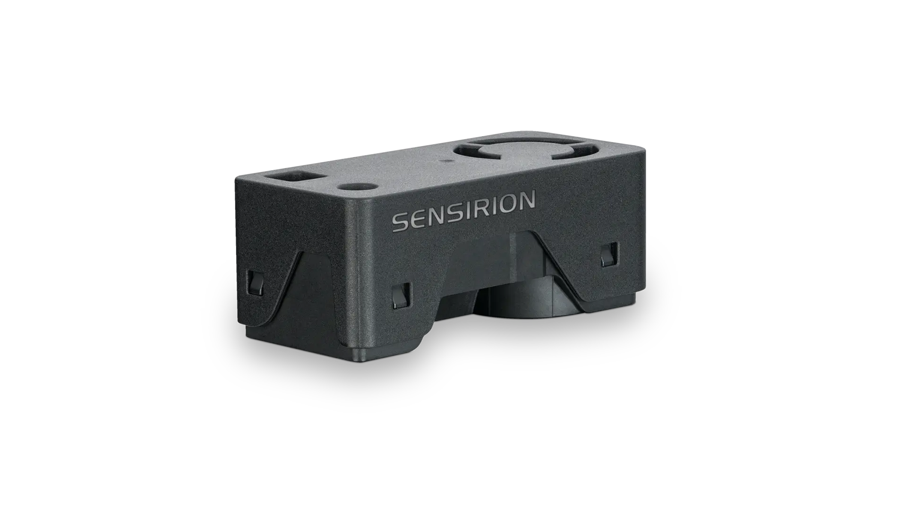
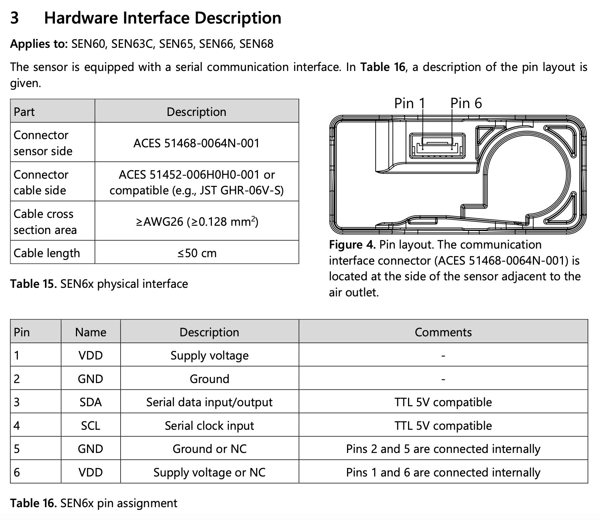
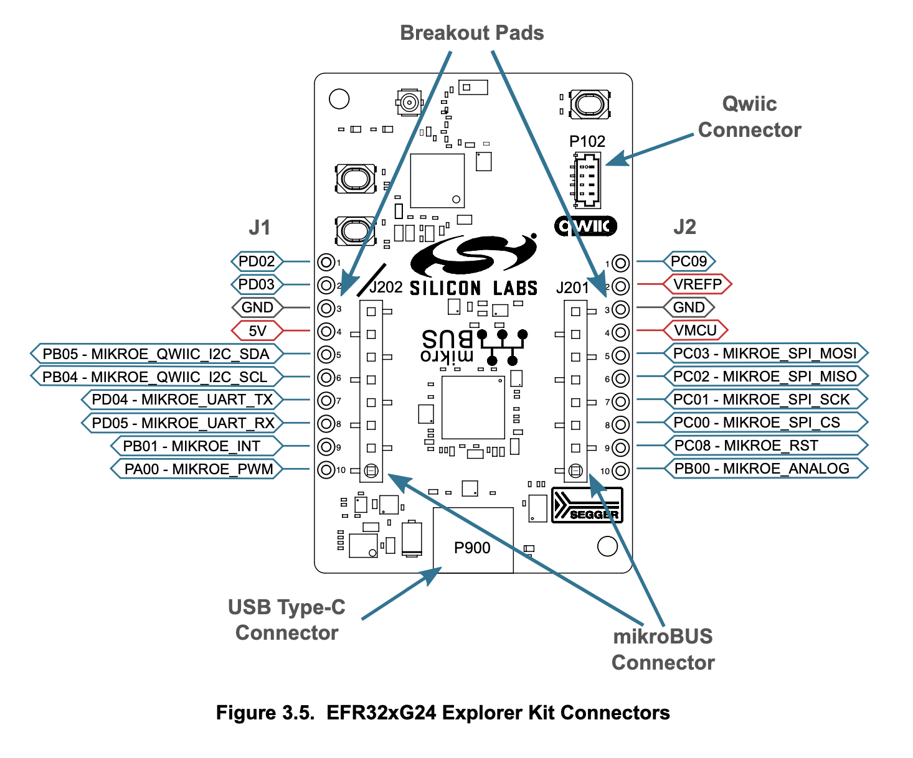
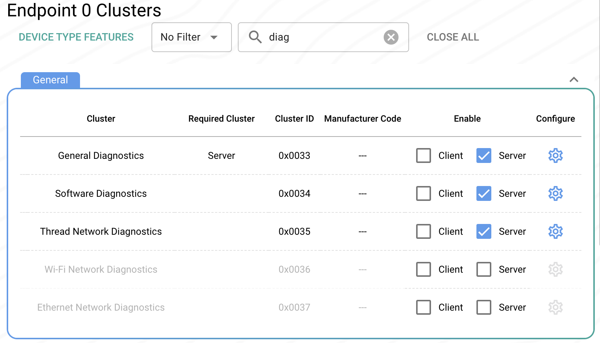
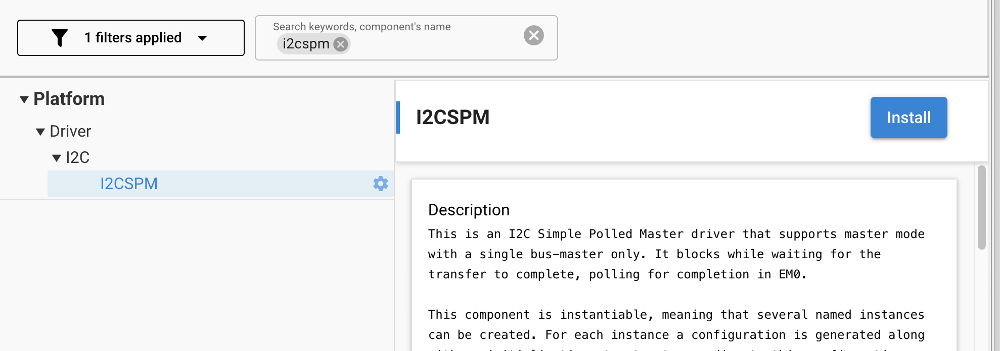
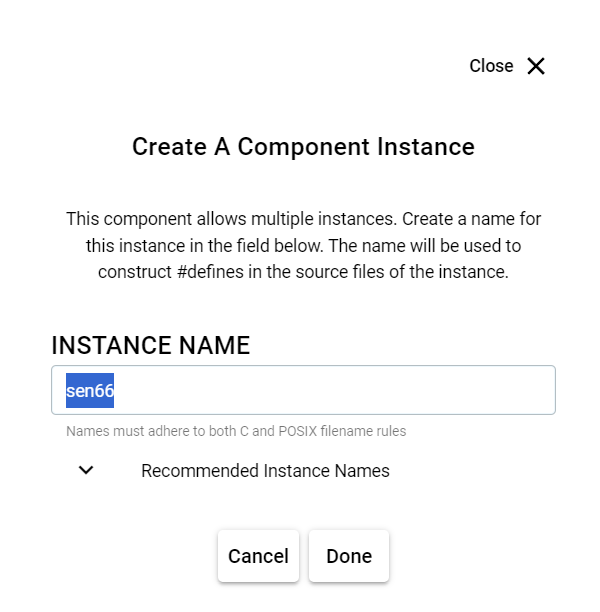
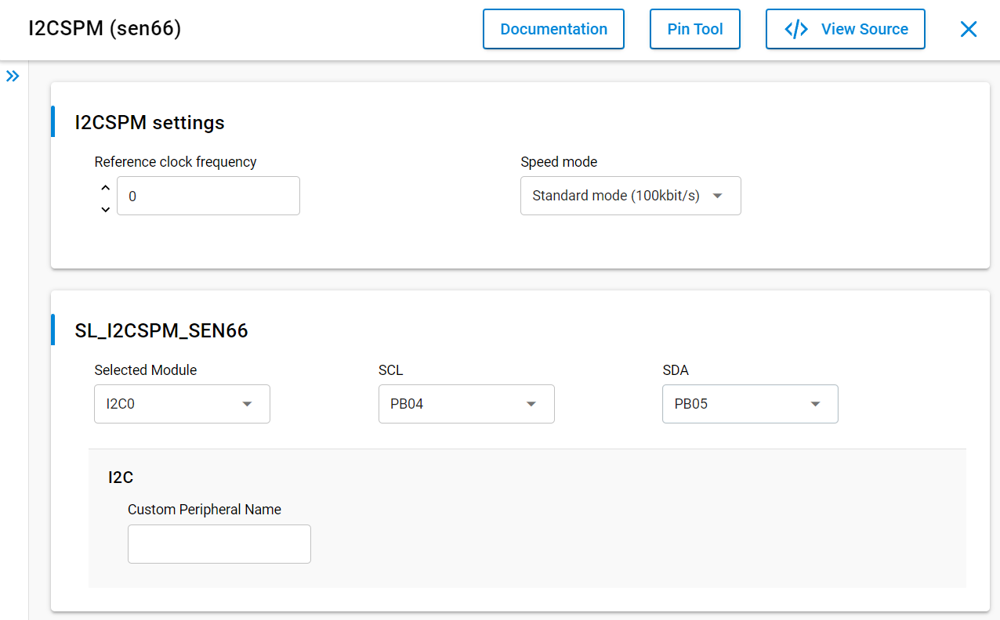
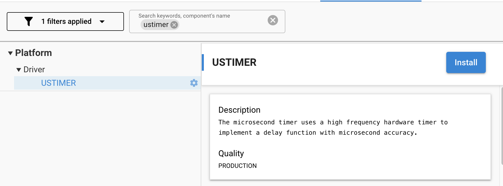

# Building a Matter over Thread Accessory Device based on the Silicon Labs EFR32xG24 Explorer Kit (BRD2703A Rev A02)
### Author: [Olav Tollefsen](https://www.linkedin.com/in/olavtollefsen/)

## Introduction

This article shows how to build a Matter Air Quality sensor with an Silicon Labs EFR32xG24 Explorer Kit board and a Sensirion SEN66 air quality sensor. The Sensirion SEN66 sensor connects to the Silicon Labs EFR32xG24 Explorer Kit using I2C and supports measuring Particulate Matter (PM1, PM2.5, PM4, PM10), Relative Humidity, Temperature, Volatile Organic Compound, NOx (nitrogen oxides) and CO2.




### What you will need

- A Mac or PC as the development workstation
- A Silicon Labs EFR32xG24 Explorer Kit board
- A Sensirion SEN66 air quality sensor

## Connect the hardware



The recommended voltage is 3.3V.



## Create a new project based on the "Matter - SoC Sensor over Thread with external Bootloader" Solution Example

Start by creating a new project in Simplicity Studio V5 by selecting the "Matter - SoC Air Quality Sensor with internal Bootloader Solution" example solution project and click "Create":


This is a good starting point as it already implements a fully functional Matter over Thread device.

Note! Due to a bug in the sample project we need to disable two clusters from the .zap file.

Open the config/common/air-quality-sensor-app.zap in the ZAP editor.

Select Endpoint #0 and enter "diag" in the Search Clusters input box.

Disable the Wi-Fi Network Diagnostics cluster and the Ethernet Network Diagnostics cluster by clearing the Server checkboxes.



Build the solution to make sure it builds with no errors.

## Add the I2C drivers to your project

Open the .slcp file in your project and select "SOFTWARE COMPONENTS".

Search for the I2CSPM component as shown below and install it:



Enter "sen66" as the instance name.



Important! Depending on which connectors we use for the I2C bus, the instance needs to be configured accordingly. If the PB04 and PB05 headers found on the J1 connector is used for SDA and SLC, the instance should be configured as shown below:



Selecting "mikroe" as the instance name will map the J1 headers PB04 and PB05 found on the J1 breakout pad to the I2CSPM as shown in the figure above. If you connect the sensor to the Qwiic connector, select "qwiic" as the instance name as this will map it correctly for the Qwiic connector.

## Add support for USTIMER to your project

Open the .slcp file in your project and select "SOFTWARE COMPONENTS".

Search for the USTIMER component as shown below and install it:



## Copy SEN66 I2C driver source files into your project

You will find I2C driver source files in this Github repo:

https://github.com/Sensirion/embedded-i2c-sen66

Copy the .h files to your include directory and the .c files to your src directory.

Replace the content of the sensirion_i2c_hal.c source file with this code:

```
#include "sensirion_i2c_hal.h"
#include "sensirion_common.h"
#include "sensirion_config.h"

#include "sl_i2cspm_instances.h"
#include "ustimer.h"

/**
 * Select the current i2c bus by index.
 * All following i2c operations will be directed at that bus.
 *
 * THE IMPLEMENTATION IS OPTIONAL ON SINGLE-BUS SETUPS (all sensors on the same
 * bus)
 *
 * @param bus_idx   Bus index to select
 * @returns         0 on success, an error code otherwise
 */
int16_t sensirion_i2c_hal_select_bus(uint8_t bus_idx) {
    /* TODO:IMPLEMENT or leave empty if all sensors are located on one single
     * bus
     */
    return NOT_IMPLEMENTED_ERROR;
}

/**
 * Initialize all hard- and software components that are needed for the I2C
 * communication.
 */
void sensirion_i2c_hal_init(void) {
  USTIMER_Init();
}

/**
 * Release all resources initialized by sensirion_i2c_hal_init().
 */
void sensirion_i2c_hal_free(void) {
}

/**
 * Execute one read transaction on the I2C bus, reading a given number of bytes.
 * If the device does not acknowledge the read command, an error shall be
 * returned.
 *
 * @param address 7-bit I2C address to read from
 * @param data    pointer to the buffer where the data is to be stored
 * @param count   number of bytes to read from I2C and store in the buffer
 * @returns 0 on success, error code otherwise
 */
int8_t sensirion_i2c_hal_read(uint8_t address, uint8_t* data, uint8_t count) {
    I2C_TransferSeq_TypeDef    seq;
    I2C_TransferReturn_TypeDef ret;

    // 7 bit address - Use format AAAA AAAX
    seq.addr  = address << 1;

    seq.flags = I2C_FLAG_READ;
    seq.buf[0].data   = data;
    seq.buf[0].len    = count;

    seq.buf[1].data = 0;
    seq.buf[1].len  = 0;

    ret = I2CSPM_Transfer(sl_i2cspm_sen66, &seq);

    return ret;
}

/**
 * Execute one write transaction on the I2C bus, sending a given number of
 * bytes. The bytes in the supplied buffer must be sent to the given address. If
 * the slave device does not acknowledge any of the bytes, an error shall be
 * returned.
 *
 * @param address 7-bit I2C address to write to
 * @param data    pointer to the buffer containing the data to write
 * @param count   number of bytes to read from the buffer and send over I2C
 * @returns 0 on success, error code otherwise
 */
int8_t sensirion_i2c_hal_write(uint8_t address, const uint8_t* data,
                               uint8_t count) {
    I2C_TransferSeq_TypeDef    seq;
    I2C_TransferReturn_TypeDef ret;

    // 7 bit address - Use format AAAA AAAX
    seq.addr  = address << 1;

    seq.flags = I2C_FLAG_WRITE;

    seq.buf[0].data   = (uint8_t*)data; // Safe to cast, since the write operation only reads the data buffer
    seq.buf[0].len    = count;

    seq.buf[1].data = 0;
    seq.buf[1].len  = 0;

    ret = I2CSPM_Transfer(sl_i2cspm_sen66, &seq);

    return ret;
}

/**
 * Sleep for a given number of microseconds. The function should delay the
 * execution for at least the given time, but may also sleep longer.
 *
 * Despite the unit, a <10 millisecond precision is sufficient.
 *
 * @param useconds the sleep time in microseconds
 */
void sensirion_i2c_hal_sleep_usec(uint32_t useconds) {
  USTIMER_Delay(useconds);
}
```

## Modify MeasurementUnit attributes for the Air Quality Clusters

The MeasurementUnit attributes for the Air QUality clusters need to be modified to match the Sensirion SEN66 reported values.

Open "air-quality-sensor-manager.h" found in your include directory and find these code lines:

```
        mPm1ConcentrationMeasurementInstance(mEndpointId, Pm1ConcentrationMeasurement::Id,
                                             ConcentrationMeasurement::MeasurementMediumEnum::kAir,
                                             ConcentrationMeasurement::MeasurementUnitEnum::kPpm),
        mPm10ConcentrationMeasurementInstance(mEndpointId, Pm10ConcentrationMeasurement::Id,
                                              ConcentrationMeasurement::MeasurementMediumEnum::kAir,
                                              ConcentrationMeasurement::MeasurementUnitEnum::kPpm),
        mPm25ConcentrationMeasurementInstance(mEndpointId, Pm25ConcentrationMeasurement::Id,
                                              ConcentrationMeasurement::MeasurementMediumEnum::kAir,
                                              ConcentrationMeasurement::MeasurementUnitEnum::kPpm),
```

Change the MeasurementUnit from kPpm ( Parts per Million) to kUgm3 ( Microgram per m3):

```
        mPm1ConcentrationMeasurementInstance(mEndpointId, Pm1ConcentrationMeasurement::Id,
                                             ConcentrationMeasurement::MeasurementMediumEnum::kAir,
                                             ConcentrationMeasurement::MeasurementUnitEnum::kUgm3),
        mPm10ConcentrationMeasurementInstance(mEndpointId, Pm10ConcentrationMeasurement::Id,
                                              ConcentrationMeasurement::MeasurementMediumEnum::kAir,
                                              ConcentrationMeasurement::MeasurementUnitEnum::kUgm3),
        mPm25ConcentrationMeasurementInstance(mEndpointId, Pm25ConcentrationMeasurement::Id,
                                              ConcentrationMeasurement::MeasurementMediumEnum::kAir,
                                              ConcentrationMeasurement::MeasurementUnitEnum::kUgm3),
```


